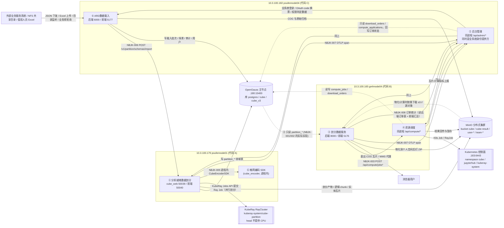

# 系统总览与子系统边界

> **一句话定位**：分析就绪数据剖分管理系统是国家对地观测科学数据中心体系化能力提升项目的关键支撑系统，
> 由 6 个子系统组成，把多源遥感 ARD 数据变成「可检索、可下载、可计算」的全球离散格网产物；
> 6 个子系统由**三份互不共享 git 历史的代码**实现，跑在**三台应用服务器 + 四节点 OpenGauss/MinIO 集群 +
> KubeRay（Kubernetes 上的 RayCluster，namespace `kuberay-system`）+ Kubernetes** 上。
>
> **本文性质**：跨子系统总览，是 `10-技术手册/T1~T6` 的入口与地图，不重复手册细节。
> **编写依据**：已定稿的 6 份技术手册 + `90-原始材料/01-代码清单.md`、
> `90-原始材料/02-实测站点地图.md`、`40-追溯矩阵/大纲追溯矩阵.md`，以及官方
> `90-原始材料/原文抽取/` 三份文档。
> **复核更新（2026-09-18）**：②分析就绪数据剖分、⑥全球离散格网模型与编码已按本仓 HEAD `dead6bf`
> 重新核对（`cube_encoder/`、`cube_split/`、`cube_web/` 与 `openapi.json` 实调）；①③④⑤ 仍以
> 2026-09-12 快照为唯一依据，本轮未重新勘察。
> **证据规则**：遵循 `90-原始材料/00-编写规范.md`——每条事实给可追溯来源；无法确认的写
> 「未能确认」并说明原因，不猜。技术手册引用格式为「手册 §节号」，代码引用格式为「文件:行号」。
> **勘察时间基准**：2026-09-12（三套运行实例的实测、快照与 commit）＋ 2026-09-18（②⑥ 本仓代码复核）。

---

## 1. 这个系统是什么

### 1.1 项目归属与依据文件

| 项 | 值 | 来源 |
| --- | --- | --- |
| 项目名称 | 国家对地观测科学数据中心体系化能力提升项目 | `原文抽取/测试大纲_LZ006-YW-02-04.md:1`、`原文抽取/实施方案_20260429.md:6` |
| 包件名称 | 分析就绪数据剖分管理系统 | `实施方案_20260429.md:207` |
| 招标编号 | `0730-2513ZC0196-02` | `实施方案_20260429.md:205` |
| 合同编号 | `AIRZW83-2025-006035`（2025-12，东北林业大学） | `实施方案_20260429.md:211` |
| 系统内部编号 | `LZ006-YW-02`（平台名称标识） | `测试大纲_LZ006-YW-02-04.md:534`（表 8） |
| 实施方案编号 | `LZ006-YW-02-03`（1.0，2026-04-29，285 页） | `实施方案_20260429.md:11` |
| 测试大纲编号 | `LZ006-YW-02-04`（2026-07） | `测试大纲_LZ006-YW-02-04.md:11` |
| 需求分析文档编号 | `LZ006-YW-02-02`（2026-01） | `实施方案_20260429.md:212` |

> **编号口径澄清**：`LZ006-YW-02` 是系统（平台）标识；`-03` 是实施方案、`-04` 是测试大纲，
> 都是同一系统名下的**文档编号**，不是两个项目。文档与代码冲突时以代码为准；表号引用必须注明
> 来自原版还是 5.3.2 修订版大纲（见 T4 §11.1、T3 §11.2）。

### 1.2 系统全流程与组成

官方对系统的定位原文（`测试大纲_LZ006-YW-02-04.md:414`）：

> 分析就绪数据剖分管理系统是"国家对地观测科学数据中心体系化能力提升项目"的关键支撑系统，
> 由 6 个子系统组成……围绕"数据接入—生产处理—质量控制—入库管理—服务应用—运行治理"的全流程
> 业务链条，提供从数据接入登记、任务编排，到格网化剖分生产、自动化质量控制、入库与版本管理的
> 生产闭环能力。

| 阶段 | 承担子系统 | 数据形态变化 |
| --- | --- | --- |
| 数据接入 | ① ARD数据载入 | 外部清单/共享目录 → 标准化元数据 + COG + 载入批次 |
| 生产处理 | ② 分析就绪数据剖分 | Dataset/Scene/Band → 格网单元 / 实体瓦片 / 索引 |
| 质量控制 | ② 分析就绪数据剖分 | 剖分产物 → `pass`/`warn`/`fail`/`error`/`cancelled` 质检记录 |
| 入库管理 | ② 分析就绪数据剖分 | 质检通过 → `rs_*` 事实表 + 版本化对象 |
| 服务应用 | ③ 剖分数据服务（算力由 ④ 提供） | 权威瓦片 → 检索/可视化/下载/在线计算 |
| 运行治理 | ⑤ 后台管理 + ④ 资源调度 | 账号/配额/审计/监控 + 作业排队/重试/对账 |
| 统一空间基准 | ⑥ 全球离散格网模型与编码 | 经纬度/GeoJSON → `space_code` + 单元几何 + 时空编码 |

**历史口径差异（必须注意）**：初设文档（`原文抽取/初设文档_V0.2_20250606.md:12`）只定义
「全球离散格网模型与编码 + 分析就绪数据剖分 + 剖分数据服务」3 个子系统；实施方案
（`实施方案_20260429.md:234`）与测试大纲（`测试大纲_LZ006-YW-02-04.md:417`~`:423`）才扩展为 6 个。
**本文与 6 份手册一律采用 6 子系统口径**，遇到旧文档的 3 子系统表述不要当成另一套系统。

### 1.3 六个子系统一句话定位

| 代号 | 子系统 | 一句话定位 | 代码落点（代号） | 官方模块 | 大纲表号 | 用例前缀 |
| --- | --- | --- | --- | --- | --- | --- |
| ① | ARD数据载入 | 把外部业务系统/离线清单的原始遥感数据接入、抽元数据、转 COG、归档并推送给剖分 | **C** `.182` | 实施方案 4.4（数据接入 + 元数据提取） | 表19~表24 | `ADM`、`NBJK` |
| ② | 分析就绪数据剖分 | 按 `geohash`/`mgrs`/`isea4h` 把 Scene 剖分成格网产物，做质检、建档、入库 | **A** `.179` | 实施方案 4.5（4.5.1~4.5.6） | 表25~表33 | `PAR` |
| ③ | 剖分数据服务 | 面向用户的检索、可视化、下载、在线计算、模型中心、算子中心与地图服务 | **B** `.165` | 实施方案 4.6（4.6.1~4.6.5） | 表34~表45 | `SERV` |
| ④ | 资源调度 | 计算作业持久化队列、配额准入、K8s Job/RayJob 执行、对账重试与运营统计 | **B** `.165` | 实施方案 4.7（4.7.1~4.7.4） | 表46~表56 | `RES` |
| ⑤ | 后台管理 | 账号/角色/权限模板、配额审批、订单、瓦片探针、系统统计与告警展示 | **C** `.182` | 实施方案 4.8（4.8.1~4.8.4） | 表57~表65 | `IAM`、`PRB`、`ODW`、`MST` |
| ⑥ | 全球离散格网模型与编码 | 无 UI 的格网编码 SDK/HTTP 服务：定位、覆盖、拓扑、时空编码 | **A** `.179` | 实施方案 4.9（4.9.1~4.9.3） | 表66~表70 | `ENC` |

官方模块分解来源：`实施方案_20260429.md:74`~`:100`。表号与用例前缀来源：
`40-追溯矩阵/大纲追溯矩阵.md` 第 1 节。代码落点代号 A/B/C 定义见 `00-编写规范.md` 第 0 节，明细见本文第 4 章。

**跨子系统用例**：性能 7 条（表71~表77，分散在 ②③④）、内部接口 8 条（表78~表85 即 `NBJK-001~008`）、
外部接口 3 条（表86~表88 即 `WBJK-001~003`）、齐套性 1 条（表18）。
合计 71 条 = 1 齐套 + 52 功能 + 7 性能 + 8 内部接口 + 3 外部接口（`测试大纲_LZ006-YW-02-04.md:556`）。

### 1.4 三套门户实例与统一登录

三套实例**各自都是带完整 6 入口的门户壳**，不是"一个中心门户 + 若干子页面"
（`02-实测站点地图.md` §1、§2）。

| 实例 | 门户地址 | 承担子系统 | 后端 | 前端 | 登录方式 |
| --- | --- | --- | --- | --- | --- |
| poufennode01（本机，`10.3.100.179`） | `http://10.3.100.179:50040` | ② 分析就绪数据剖分、⑥ 格网编码 | `uvicorn cube_web.app:app`，`50039` | Vite，`50040` | 跳转 `.182:5177/login`，`client_id=system_ard` |
| poufennode04（`10.3.100.182`） | `http://10.3.100.182:5177` | ① ARD数据载入、⑤ 后台管理 | `uvicorn main:app`，`6000` | Vite，`5177` | 本地 `/login`，**同时是全系统登录页提供方** |
| gmhnode04（`10.3.100.165`） | `http://10.3.100.165:5176`（hash 路由） | ③ 剖分数据服务、④ 资源调度 | `uvicorn backend.main:app`，`8000` | Vite，`5176` | 落地页「登录」→ 跳转 `.182:5177/login`，`client_id=system_src_me` |

**关键事实**：三套实例共用一套 NODA（国家对地观测科学数据中心）单点登录，登录页由 `10.3.100.182:5177`
提供，跳转形态为 `?client_id=&redirect_uri=&state=` → 回跳 `?target=&code=&state=`
（`02-实测站点地图.md` §1）。实现上，`.182` 的 ⑤ 子系统（`routers/auth.py`）既对接 NODA OAuth，
又向另外两套实例提供 `/api/authorize`、`/api/exchange_code` 一次性授权码换票
（T5 §7.1；对应外部接口 `WBJK-003`，见 `测试大纲_LZ006-YW-02-04.md:458`）。
另发现 `.182:5177` 门户 Logo 图片直接引用 `http://10.3.100.165:5176/noda-logo.png`，
两套前端存在静态资源级耦合（`02-实测站点地图.md` §2 末段）。

---

## 2. 子系统之间的数据流与依赖

### 2.1 数据流总图



ASCII 速查版（同一张图的文字化，便于无 Mermaid 环境阅读）：

```text
外部业务系统/共享目录/Excel
        │ 清单
        ▼
① .182:6000 ──HTTP /v1/partition/schemas/import──▶ ② .179:50039 ──SDK──▶ ⑥ 格网编码(进程内)
        │                                                  │
        ├─写 postgres 库(批次/场景/审计)                    ├─写 cube_v3 库(partition_*/rs_*)
        └─写 MinIO(user-*/team-*)                           ├─写 MinIO cube 桶(瓦片/索引)
                                                            └─KubeRay Jobs API 提交 Ray Job（namespace kuberay-system）
                                                                     │
                                       ③ .165:8000 ◀──只读 cube_v3 partition_*───┘
                                             │  ^ 读 MinIO 源对象
                                             ▼
                                       ④ .165:8000 ──K8s Job/RayJob──▶ K8s .183:6443
                                             │                             │
                                             └─────结果回 MinIO/cube ◀─────┘
⑤ .182:6000/5177 = 全系统登录页 + 身份提供方；只读 cube.test.download_orders/compute_applications 并回写状态
① ② ③ ④ ──OTLP span 上报──▶ ⑤ /api/v1/traces（NBJK-007）
```

### 2.2 数据流逐步说明（含证据）

| # | 流向 | 内容 | 实现方式 | 证据 |
| --- | --- | --- | --- | --- |
| 1 | 外部 → ① | 清单/数据 | 4 条入口：网络下发 `POST /api/orders/receive-manifest`、离线 Excel 上传、目录监听、业务库轮询 | T1 §1.1 能力 1~4 |
| 2 | ① 内部 | 解析 → 元数据标准化 → COG → MinIO 归档 | `metadata_extractor.process` 主流程（18 步） | T1 §8.3 |
| 3 | ① → ② | Dataset/Scene/Band manifest | `POST /v1/partition/schemas/import`（**公开导入入口，免 Bearer**） | T1 §7.1、T2 §4.2 |
| 4 | ① → ②（反查） | 查剖分状态、归档批次 | `GET /v1/partition/load-batches/{id}/scenes`、`POST /v1/partition/load-batches/{id}/archive`、`POST /v1/datasets/{id}/archive`；① 另会先尝试 `POST .../load-batches/{id}/delete`，但 **② 侧无该路由**，按 404 回落归档（详见 `03-子系统接口矩阵.md` §6 R-7） | T1 §7.1、T2 §4.3 |
| 5 | ② → ⑥ | 定位/覆盖/拓扑/时空编码 | **进程内 `grid_core.sdk.CubeEncoderSDK`**，不走 HTTP | T6 §1.3、§7.1 |
| 6 | ② → KubeRay | 并行剖分分片 | KubeRay Jobs API 提交 Ray Job（`cube_web/cube_web/services/ray_job_submitter.py:130` 的 `submit_job`；`ray_logical_chunk_job`、`entity_partition_job`）；worker 把源 COG **原样**缓存到本地（不再做 COG 转换），产物写回 MinIO | T2 §8.2、§8.3；`AGENTS.md`「Ray 分布式计算集群（KubeRay）」节、`cube_web/docs/KUBERAY_OPERATIONS.md` |
| 7 | ② → OpenGauss `cube_v3` | `partition_datasets/scenes/assets/tiles/grid_cells/indexes` + `rs_*` 事实表 | 直连 DSN（`psycopg`），非 HTTP | T2 §5.1、§7 |
| 8 | ② → MinIO | 实体瓦片、逻辑 chunk（`logical-chunks/*.jsonl.gz`）、质检产物 | 对象存储写入 + checksum 校验 | T2 §1.1「输出版本对象读写」 |
| 9 | ② → ③ | 权威瓦片可见性 | **③ 直连同一个 `cube_v3` 库只读 `partition_*`**（大纲把 `NBJK-001/002` 定义为 ②→③ 的 WEB 接口，实现上是共享库） | T3 §1.3、§7.1；T2 §1.3 |
| 10 | ③ → 用户 | 检索结果、COG 瓦片、GeoServer WMS、ZIP 下载、在线计算入口 | `backend/api/search.py`、`visualization.py`、GeoServer 8081、物化包 + `user_workspace` | T3 §1.1 能力 1~8 |
| 11 | ③ → ④ | 计算/物化/导出作业 | `enqueue_compute_job`（`POST /api/compute/jobs`、`/jobs/batch`、`/jobs/tile-batch`） | T3 §7.1、T4 §1.3 |
| 12 | ④ → K8s/Ray | Job/RayJob 执行；结果回 MinIO；成功结果发布 WMS | `operator_executor`、`compute_worker`、`geoserver_publish` | T4 §8.1~§8.5 |
| 13 | ③④ → ⑤ | 瓦片/计算指标 | `POST /api/v1/traces`（OTLP span，**无鉴权**，登记在 T5 进程） | T3 §7.1、T5 §4.7、§9.3 |
| 14 | ⑤ → ③④ | 只读订单/申请表 + 回写状态 | `order_mgmt.py` 直连 `cube` 库 `test` schema | T5 §1.3、§7.1 |
| 15 | ⑤ → 全部 | 身份、角色、权限判定 | `.182` 作为登录页与 OAuth 授权码服务端；各子系统用 Bearer token 访问 `/api/me` | T5 §7.1、T2 §4.7、T4 §2.2（`AUTH_CENTER` 默认 `http://10.3.100.182:5177`） |

### 2.3 官方 8 条内部接口 vs 代码实现

编号来源：`测试大纲_LZ006-YW-02-04.md:440`（表 3）；实现核对来自 6 份手册。

| 编号 | 官方定义（发送方 → 接收方） | 代码中的实际实现 | 与大纲的差异 |
| --- | --- | --- | --- |
| `NBJK-001` | 剖分数据加载：② → ③ | ③ 只读 `cube_v3.partition_tiles/partition_grid_cells`，无 ②→③ 的 HTTP 服务 | 实现为共享库读取，非 WEB 接口 |
| `NBJK-002` | 剖分数据查询：② → ③ | 同上；② 另有只支持碳卫星的 `/v1/query/st` | 方向与载体不同；`/v1/query/st` 只支持 `data_type=carbon`（T2 §4.1） |
| `NBJK-003` | 调度任务提交与编排：③ → ④ | `POST /api/compute/jobs`、`/jobs/batch`、`/jobs/tile-batch` | 一致；返回 `job_id`（T4 §1.1 第 28 项），大纲用词为 `JobID` |
| `NBJK-004` | 剖分瓦片存储：② → 分布式存储 | MinIO `cube` 桶 + `rs_*` 事实表 | 一致 |
| `NBJK-005` | 离散格网编码接口：② → ⑥ | 进程内 `CubeEncoderSDK`（HTTP `50012` 服务存在但**未常驻运行**） | 生产链路走 SDK；独立 HTTP 服务非必经环节（T6 §2） |
| `NBJK-006` | 数据载入剖分接口：① → ② | `POST /v1/partition/schemas/import` | 一致；该路径是唯一公开（免鉴权）导入入口 |
| `NBJK-007` | 瓦片监测接口：②③ → ⑤ | 三份代码各自有 `tile_logger.py`，POST 到 `.182:6000/api/v1/traces` | ④ 也上报；上报端点无鉴权；客户端 SDK 内的上报 URL 仍有旧机器残留（T5 §9.8） |
| `NBJK-008` | 订单统计接口：③ → ⑤ | ⑤ 直读 `cube.test.download_orders`/`download_order_items`/`compute_applications`，③④ 侧另有 `/api/download-orders/*` | 实现为共享库 + 双向回写，非单向接口 |

**外部接口 3 条**（`测试大纲_LZ006-YW-02-04.md:458`，表 4）：

| 编号 | 官方接口 | 代码现状 |
| --- | --- | --- |
| `WBJK-001` | 剖分影像源获取（业务服务系统） | ① 有 NODA 对接与离线清单两套入口（T1 §4.1、§4.2） |
| `WBJK-002` | 大屏信息推送（业务服务系统） | **未实现**：`.165` 仓库自带审查报告指出「订单列表/管理/统计/大屏推送 API 与前端页面缺失」；同类数据目前只在 ⑤ 内部的后台看板可见（追溯矩阵 §5） |
| `WBJK-003` | 全局身份鉴权（NODA） | ⑤ 实现 NODA OAuth；其余子系统先对接 `.182` ⑤，再由 ⑤ 对接 NODA（T5 §8.2） |

### 2.4 子系统依赖矩阵

行 = 调用方/消费方，列 = 被依赖方。`HTTP` = 运行期接口调用；`SDK` = 进程内库；
`DB` = 共享数据库读写；`被动` = 只被读取/被调用，不主动调用；`—` = 无依赖。

| ↓调用方 / →被依赖 | ① T1 | ② T2 | ③ T3 | ④ T4 | ⑤ T5 | ⑥ T6 |
| --- | --- | --- | --- | --- | --- | --- |
| **① T1** | — | HTTP（导入、查询、删除/归档） | — | 无直接接口（本仓同名 `quota_guard` 走 Redis，见 §3.3） | DB（同进程共享 `users/teams/audit_logs`） | — |
| **② T2** | 被动（消费 manifest） | — | 被动（写 `published` 状态） | 按 KubeRay Jobs API 提交（不经 ④ 队列） | 被动（校验 ⑤ 主认证 token） | SDK |
| **③ T3** | 被动（读 MinIO 源对象） | 被动（只读 `cube_v3.partition_*`） | — | HTTP（提交计算/物化/导出作业） | HTTP（治理闸门 + 指标上报）+ DB（读订单表） | 仅 `grid_type` 字符串 |
| **④ T4** | — | 被动（消费 `tile_refs`/物化包） | 被动（承接 ③ 提交） | — | HTTP（`/api/me` 取身份与 `resource_schedule:*` 权限） | — |
| **⑤ T5** | 同进程（不同路由前缀） | — | DB（只读订单 + 回写状态） | DB（只读申请表） | — | — |
| **⑥ T6** | — | 被动（被 SDK 调用） | — | — | — | — |

### 2.5 三条隐式耦合通道（比接口更容易出问题）

| 通道 | 内容 | 影响 | 证据 |
| --- | --- | --- | --- |
| **共享库 `cube_v3`** | ② 写 `partition_*`，③ 直读同一批表；③ 的物化路径只判 `pt.status='ready'` + `pd.partition_status IN ('completed','running')`，**不判 `publication_status`**（`grep -c publication_status backend/services/cube_v3_compute.py` = 0） | ② 的表结构/状态语义变更会直接影响 ③；`publication_status='published'` 契约在物化链路上未强制 | T3 §1.3、§4.4；T2 §1.3 |
| **共享库 `cube`（schema `test`）** | ③④ 写 `compute_jobs`/`download_orders`/`user_workspace_*`/`operators`/`model_*`，⑤ 只读订单与申请表并回写 `status/progress/finished_at` | 跨仓库的 DDL 变更必须由 ③④ 与 ⑤ 双方协调；⑤ 的审批会改变 ③④ 的行为 | T4 §5.1、T5 §5.2、§7.1 |
| **共享身份与配额约定** | ① 的 `services/quota_guard.py` 直连 Redis（`redis://localhost:16379/0`）+ MinIO `mc quota`；④ 的配额在 OpenGauss（`resource_quota`/`storage_quota`/`governance`）；⑤ 审批后把配额值写 Redis 与用户列 | **同名不同物**：①⑤ 的 `quota_guard` 是 C 仓本地模块，④ 的配额是 B 仓 OpenGauss 账本。改动配额语义要同时看两侧 | T1 §7.1（`enforce_storage_limit` 全仓 0 调用）、T5 §1.1、§7.1、T4 §7.1 |

### 2.6 数据面与部署面

| 数据面 | 归属 | 读方 | 写方 |
| --- | --- | --- | --- |
| OpenGauss 库 `postgres`（主节点 `.180:15400`） | ① ⑤ | ① ⑤ | ① ⑤ |
| OpenGauss 库 `cube_v3` | ② | ② ③ | ② |
| OpenGauss 库 `cube`（schema `test`） | ③ ④ | ③ ④ ⑤ | ③ ④ |
| MinIO 桶 `cube` / `cube-result` | ② ③ ④ | ② ③ ④ | ② ③ ④ |
| MinIO 桶 `user-{id}` / `team-{id}` | ① ⑤ | ① ③ ④ ⑤ | ① ③ ④ ⑤ |
| KubeRay RayCluster（② `kuberay-system/cube-partition`；④ `cube/cube-ray`） | ② ④ | ② ④ | ② ④ |
| Kubernetes（`cube`、`jupyterhub` 命名空间） | ③ ④ | ③ ④ | ④ |

---

## 3. 子系统边界表

### 3.1 六子系统「负责 / 不负责」总表

| 子系统 | 负责什么（摘要） | 明确不负责什么 |
| --- | --- | --- |
| ① ARD数据载入 | 清单接入（网络/离线/目录/业务库轮询）、幂等去重、优先级调度、异构格式解析、16 条标准元数据规则、字典映射、COG 归档、批次/资产落库、回环反馈、推送 ② 与批次删除/归档 | 不做格网剖分、不做格网编码（全仓无 encoder 依赖）、不写外部业务库（只写 `feedback_*` 四列）、不管 `/api/admin/*` 后台 |
| ② 分析就绪数据剖分 | 四类数据族（光学/雷达/信息产品/碳卫星）的格网剖分运行、托管批次全生命周期（提交/取消/终止/重试/对账）、输出版本对象读写、自动化质检（8 必选 + 6 可选规则）、质检导出、入库到 `rs_*`、数据集管理、AOI 回读（仅 CLI）、碳卫星时空查询、格网 facade | 不实现格网算法（全部委托 ⑥）、不做数据载入/元数据抽取（①）、不做地图服务发布、不做资源调度/配额治理（④）、不做用户权限主数据（⑤） |
| ③ 剖分数据服务 | 检索（bbox/polygon/时间/类型）、结果展示、下载（物化到个人空间再打 ZIP）、可视化（COG 直出 + GeoServer）、在线计算入口、模型仓库、算子中心、下载订单生命周期、Notebook 交互式计算、瓦片指标上报 | 不做格网编码/拓扑、不写 `partition_*`（只读）、不做作业调度/配额/执行器选择（④）、不做审计与后台管理（⑤） |
| ④ 资源调度 | `compute_jobs` 持久化队列、4 个逻辑队列与 P0/P1/P2 分级、CPU/存储/治理配额与窗口限流、执行计划（k8s_job/ray_job/auto）与降级链、K8s Job/RayJob 提交、运行中作业对账、指数退避重试、运营快照、线性/汇聚工作流编排、算子与模型注册运行校验、Notebook 运行时、下载订单对账 | 不做格网编码与剖分、不拥有剖分/检索数据、不做认证中心、不做门户框架、不做物理数据面治理（无网络 QoS/IO 限流）；**未实现** GPU/内存/并发数/带宽配额、作业抢占、提交幂等键、逐次状态审计 |
| ⑤ 后台管理 | 本地账号与 NODA OAuth/TOTP/邮箱码、会话与滑动续期、行为审计、用户/角色/操作员岗位模板、配额申请审批与资源拨备、科学家团队、订单管理（含 WS 推送）、瓦片 5×5 时域统计与链路明细、系统资源汇聚与告警展示、报表导出、存储网关、**全系统单点登录服务端** | 不做格网编码/剖分、不产生 ARD 数据、不做告警对外通知（无 Alertmanager）、不维护 Prometheus/Grafana 自身规则、不替代 ④ 的配额执行 |
| ⑥ 全球离散格网模型与编码 | `geohash`/`mgrs`/`isea4h` 三类生产格网的定位、批量定位、覆盖（含 `minimal`/`compact`）、拓扑（邻接 k≤5、父、子）、编码↔几何、时空编码生成/解析/校验、`CubeEncoderSDK`、独立 HTTP 服务、性能烟测门禁、DGGRID v8.44 权威向量基线 | 不持久化任何数据（无 SQL/DSN/对象存储）、不读写影像/COG/瓦片、不做任务编排/队列/鉴权/审计、不做服务侧 AOI 查询、不生成 `preview_cells`（属 `cube_web`）、不承载 Web 页面（页面在 `cube_web` 前端） |

证据：T1 §1.1/§1.2、T2 §1.1/§1.2、T3 §1.1/§1.2、T4 §1.1/§1.2、T5 §1.1/§1.2、T6 §1.1/§1.2。

### 3.2 每个子系统的一句话对外承诺

| 子系统 | 对其它子系统承诺 | 需要别人保证的前提 |
| --- | --- | --- |
| ① | 「我推送的 manifest 里 `load_batch_id` 可重复导入、幂等去重」（唯二唯一索引） | ② 的公开导入接口可用；MinIO 源对象存在 |
| ② | 「我在 `cube_v3.partition_*` 里给出 `status='ready'` 且带质检状态的权威瓦片」 | ① 交付的 manifest 与 `s3://` 对象真实存在（`_verify_assets_exist` 预检）；⑥ 的 SDK 与 5 个逻辑/实体作业入口稳定 |
| ③ | 「我提供检索—下载—计算—发布的用户面，并只读你的数据」 | ② 的表结构与 `published` 语义；④ 接受作业并回写状态；⑤ 提供身份与治理闸门 |
| ④ | 「作业持久化、可重试、有对账；结果落到 MinIO 指定前缀」 | ③ 提供 `workspace_asset_id`/`tile_refs` 等输入；K8s/MinIO/GeoServer/认证中心可达；`SCENE_DATABASE_URL` 必须设置，否则 CPU 配额静默关闭（T4 §9 F-17） |
| ⑤ | 「登录一次，三套实例通行；配额审批后写入 Redis 与用户列」 | NODA 外网可用；Redis 回环端口 `16379` 可用；③④ 的订单表结构稳定 |
| ⑥ | 「给定点/面/编码，返回确定性的格网单元、几何与编码；不落任何数据」 | 调用方不得复制格网逻辑（`AGENTS.md` 与 `cube_encoder/docs/ARCHITECTURE.md:77`） |

### 3.3 四处最容易混淆的边界

| 易混淆点 | 事实 | 证据 |
| --- | --- | --- |
| ① 与 ⑤ 是「两个子系统」还是「一个系统」 | **同一 FastAPI 进程、同一数据模型**（`.182:6000`，`main.py:390`~`:398` 注册路由）；区别只在路由前缀与职责：`/api/ard/*` 属 ①，`/api/admin/*` 属 ⑤。官方大纲称「后台管理系统」，代码里不是独立部署 | T5 §11「大纲与代码的其他差异」第 3 条 |
| ③ 与 ④ 是「两套服务」还是「一个后端」 | **同一仓、同一后端进程**（`.165:8000`，`uvicorn backend.main:app`）；③ 管服务与交互面，④ 管队列与执行面。资源调度不是独立部署的调度服务 | T3 §2.1、T4 §2 |
| ② 与 ③ 之间怎么传数据 | 不是 HTTP 推送，而是 **③ 直连 ② 写入的 `cube_v3` 库只读**；大纲 `NBJK-001/002` 的「② → ③ WEB 服务」在代码中不成立 | T3 §1.3、§7.1 |
| ①⑤ 的 `quota_guard` 是不是 ④ 的资源调度 | **不是**。`backend/app/services/quota_guard.py` 是 C 仓本地模块，直连 Redis 与 MinIO CLI；④ 的配额在 B 仓 OpenGauss 账本 + 治理表。二者只是同名 | 快照 `poufennode04_my_demo/backend/app/services/quota_guard.py:1`~`:28`；T4 §7.1 |

---

## 4. 三台机器的代码落点与仓库归属

### 4.1 应用服务器（三套门户）

| 项 | `.179` poufennode01（本机） | `.165` gmhnode04 | `.182` poufennode04 |
| --- | --- | --- | --- |
| 承担子系统 | ② 分析就绪数据剖分、⑥ 格网编码 | ③ 剖分数据服务、④ 资源调度 | ① ARD数据载入、⑤ 后台管理 |
| 代码路径 | `/home/lyajun/projects/cube_project` | `/home/nefu_dev_xc/cube` | `/home/guanwang/my_demo` |
| 后端 | `cube_web` 50039 | 后端 8000 | 后端 6000 |
| 前端 | Vite 50040 | Vite 5176（hash 路由） | Vite 5177 |
| 启动方式 | `PYTHONPATH=cube_encoder:cube_split:cube_web python3.11 -m uvicorn cube_web.app:app --host 0.0.0.0 --port 50039` | `scripts/dev_up.sh`（并发拉起 backend/frontend/notebook） | `start-tmux-services.sh`（tmux 会话 `backend`/`frontend`/`mock`） |
| 运行用户 | `lyajun` | 未确认（路径属主 `nefu_dev_xc`） | `guanwang`（tmux 与路径一致） |
| 额外端口 | ⑥ 独立服务 50012 **未启动** | GeoServer 8081、内网镜像仓库 15000 | Mock 外部系统 8001、Prometheus 19090、Grafana 13000 |
| 运行时基座 | K8s 节点 `poufennode01`（**已 cordon**，不承接 Pod；不再是 Ray worker） | K8s 节点 `gmhnode04`，可承接计算 Job | OpenGauss/MinIO 节点；**不在 K8s 集群内**（KubeRay head/worker 也不在此） |
| 部署版本 | HEAD `dead6bf`，工作区干净（②⑥ 已按该版本复核；2026-09-12 时为 `4fe4734` + 未提交改动） | **未能确认**（快照无 `.git`；协调记录为 `1da4d44f`，无法复核） | **未能确认**（快照无 `.git`；协调记录为 `e59d37b`，无法复核） |

证据：T2 §2.1、T3 §2.1、T4 §2、T5 §2.1、T6 §2、T1 §2.1、`02-实测站点地图.md` §1；
版本口径见 `40-追溯矩阵/大纲追溯矩阵.md` §6 D3。

### 4.2 基础设施（四节点集群，三套实例共用）

| 组件 | 拓扑 | 用途 | 使用方 |
| --- | --- | --- | --- |
| OpenGauss 7.0.0-RC3 | 主节点 `10.3.100.180:15400`；备：`.179`/`.181`/`.182` | 库 `postgres`（①⑤）、`cube_v3`（②③）、`cube`+schema `test`（③④⑤） | ① ② ③ ④ ⑤ |
| MinIO 分布式集群 | `.179`/`.180`/`.181`/`.182` 各 `:9000`，Console `http://10.3.100.181:9001` | bucket `cube`、`cube-result`、`user-*`、`team-*` | ① ② ③ ④ ⑤ |
| Ray（KubeRay） | ②：RayCluster `kuberay-system/cube-partition`（head `--num-cpus=0`；worker 组 `partition-workers` max 14、`partition-workers-large` max 5；Jobs API `http://10.3.100.183:30826`）。④：B 仓 ④ 创建 `ray.io/v1` RayJob CR（`cube` 命名空间，同命名空间另有 `cube/cube-ray` RayCluster 实测在线） | ② 的并行剖分执行面；④ 的 RayJob 执行面 | ② ④ |
| Kubernetes | 控制面 `10.3.100.183:6443`，namespace `cube`（作业）与 `jupyterhub`（Notebook），tasks 节点 `.165`/`.180`/`.181` | ④ 的作业执行与 ③ 的 Notebook 运行时 | ③ ④ |
| GeoServer 2.25.2 | `.165:8081`（内置 Tomcat，BiSheng JDK 17） | WMS/WMTS/ImageMosaic 发布 | ③ ④ |
| JupyterHub | chart 3.3.8，release `cube-jupyterhub`，Hub/Proxy NodePort `31081`，`baseUrl=/jupyterhub/` | ③ 的交互式计算 | ③ ④ |
| NODA 身份认证 | `https://noda.ac.cn/ca/oauth/*`（外网） | 统一身份 | ⑤（再代理给 ①~④） |
| Prometheus / Grafana | `.182:19090` / `.182:13000`，node-exporter 5 台 `:9100` | ⑤ 的系统统计与告警展示 | ⑤ |
| 内网镜像仓库 | `.165:15000`（podman `registry:2`），镜像前缀默认 `10.3.100.165:15000` | 算子/模型/Notebook 镜像 | ④ |

证据：T2 §2.2、T3 §2.2、T4 §2.2、T5 §2.2、T1 §2.2、T6 §2.1（⑥ 不依赖任何中间件）、`AGENTS.md`「基础设施集群信息」、`cube_web/docs/KUBERAY_OPERATIONS.md`；KubeRay 行另据 2026-09-18 `kubectl get raycluster` 实测。

> 历史（已弃用）：裸机 Ray head/GCS `10.3.100.182:6379`、Dashboard `http://10.3.100.182:8265`（2026-09-13 起不再用于生产与测试；2026-09-18 复查端口不可达）。

### 4.3 代码仓库归属

| 代号 | 机器 | 代码路径 | GitHub 仓库 | 复核状态 |
| --- | --- | --- | --- | --- |
| **A** | `10.3.100.179` | `/home/lyajun/projects/cube_project` | `zarttic/cube_core`（公开） | **已复核**：`git remote -v` → `https://github.com/zarttic/cube_core.git`（2026-09-12 本机） |
| **B** | `10.3.100.165` | `/home/nefu_dev_xc/cube` | 项目交接记录记为 `xiangchaoshiaksl/cube1` | **未能复核**：快照内无 `.git`（`git rev-parse HEAD` → `fatal: not a git repository`）；`gh repo view xiangchaoshiaksl/cube1` 返回 `Could not resolve to a Repository`（私有、无权限或名称有误，三种可能未区分） |
| **C** | `10.3.100.182` | `/home/guanwang/my_demo` | 项目交接记录记为 `1ggd/ard-partition-system` | **未能复核**：同上；`gh repo view 1ggd/ard-partition-system` 同样 `Could not resolve` |

三份代码的**独立性**可与本机文件系统事实互相印证：三条部署路径互不重叠、各有独立
`README`、`requirements.txt`/`pyproject.toml` 与前端工程，快照之间没有共享 `.git`
（`cube_docs_workspace/snapshots/` 下两个快照均无 `.git`）。因此「三份代码 = 三个仓库」与目录事实一致，
但 **B/C 的具体仓库名仍需项目负责人确认后才能对外引用**（见 §6.2 待复核清单第 1 项）。

各仓库内部包/目录归属：

| 仓库 | 目录 | 归属子系统 | 说明 |
| --- | --- | --- | --- |
| A `cube_core` | `cube_encoder/`（Python 包 `grid_core`，分发名 `cube-encoder`） | ⑥ | SDK + 独立 HTTP 服务 + 测试基线 |
| A | `cube_split/`（包 `cube_split`） | ② | 剖分/入库/质检/AOI 执行层（Ray 作业、CLI） |
| A | `cube_web/`（包 `cube_web` + `frontend/`） | ②（前端同时承载 ⑥ 页面） | FastAPI 托管编排层 + Vue/Vite 门户 |
| B `cube`（待确认仓库名） | `backend/` + `frontend/` | ③ ④ | 单后端两子系统，Vue hash 路由前端 |
| B | `operators/`、`deploy/k8s/`、`scripts/` | ④（`operators` 兼 ③ 的算子资产） | 算子容器、K8s 清单、部署脚本 |
| C（待确认仓库名） | `backend/app/routers/{ard,orders,...}`、`services/{order_watcher,metadata_extractor,COG,...}` | ① | 与 ⑤ 同进程 |
| C | `backend/app/routers/{admin,auth,users,order_mgmt,monitor,storage,resource}`、`frontend/` | ⑤ | 与 ① 同进程 |

### 4.4 版本状态（接手前先看这一条）

| 事实 | 说明 |
| --- | --- |
| A 已是干净 commit，B/C 仍不可复现 | A：2026-09-18 复核时为 HEAD `dead6bf`、工作区干净（2026-09-12 时为 `4fe4734` + 未提交改动）；B/C：快照无 `.git`，协调记录里的 `1da4d44f`/`e59d37b` 在本机无法复核（追溯矩阵 §6 D3） |
| A 的 2026-09-12 工作区改动集中在 ② | `quality_rules.py`（规则集 `2026.09.12-v10`）、`config_store.py`、`scene_repository.py`、质检前端等 12 改 + 3 未跟踪；`cube_encoder/` 子树干净（T2 头部与 T6 头部）。2026-09-18 复核时这些改动已不在工作区 |
| 引用行号前必须确认版本 | 6 份手册的行号对应「快照/工作区当前内容」；干净 checkout 后行号会偏移（T2 手册头部给出了换算表） |
| B/C 的代码时间窗不等于部署时间 | 快照文件 mtime 跨 2026-08-06 ~ 2026-09-12（T5 头部、T4 头部） |

### 4.5 运行实例存活核验（可复跑）

```bash
# .179（本机）② + ⑥
curl -s http://127.0.0.1:50039/health                       # 预期 status=ok，partition_queue.queued=0
ss -ltnp | grep -E ':(50039|50040|50012)'                    # 预期有 50039/50040，无 50012

# .165 ③ + ④
curl -s -o /dev/null -w '%{http_code}\n' http://10.3.100.165:8000/api/healthz   # 预期 200，bootstrap.state=ready
curl -s -o /dev/null -w '%{http_code}\n' http://10.3.100.165:5176/             # 预期 200
curl -s -o /dev/null -w '%{http_code}\n' http://10.3.100.165:8081/geoserver/web/ # 预期 302

# .182 ① + ⑤
curl -s -o /dev/null -w '%{http_code}\n' http://10.3.100.182:6000/             # 预期 200
curl -s -o /dev/null -w '%{http_code}\n' http://10.3.100.182:5177/             # 预期 200
```

证据：T2 §10.2、T3 §2.1 与 §10.1、T4 §2 与 §10.4、T1 §10.1、T6 §2。所有命令只读，不修改任何服务。

---

## 5. 阅读指引

### 5.1 按角色

| 角色 | 建议阅读顺序 | 说明 |
| --- | --- | --- |
| **完全没接触过项目的工程师** | 本文 → `10-技术手册/T6` → 自己负责子系统的手册 → `40-追溯矩阵/大纲追溯矩阵.md` | 先建立「几套系统、跑在哪、谁调谁、哪个仓库是谁的」；T6 是最小且边界最清晰的一本（799 行，无外部依赖） |
| **① 载入 / ⑤ 后台 维护者** | 本文 → T1 → T5 → `snapshots/poufennode04_my_demo/README.md` | 同一进程两个路由组；先读 T1 §4 接口清单与 T5 §5 数据模型 |
| **② 剖分维护者** | 本文 → T2 → T6 → `cube_web/docs/README.md`、`cube_split/docs/README.md` | 必须同时掌握 ② 与 ⑥，因为 ② 的格网能力全部来自 ⑥ 的 SDK |
| **③ 服务 / ④ 调度维护者** | 本文 → T4 → T3 → `docs/current_state.md`（B 快照） | 同一后端两个功能域；先读 T4 的队列与执行计划，再读 T3 的检索与物化 |
| **测试与验收人员** | 本文 §1.1/§2.3 → 各手册 §11（与大纲差异）→ 各手册 §10（验证方法）→ 追溯矩阵 | 大纲表号存在多版本口径（T4 §11.1、T3 §11.2），引用时必须注明来源 |
| **运维 / 部署人员** | 本文 §4 → 各手册 §2（部署）与 §6（配置项）与 §9（失败模式） | 所有真实凭据只来自运行时环境变量或本地 `.cube_web.env`，不要抄进配置表 |
| **操作用户 / 业务人员** | 本文 §1.3 表格 → `20-操作手册/`（U0~U6） | 操作手册按角色给点击路径与截图；U0~U6 共 7 份正文、引用 62 张标注图（2026-09-17 入库；截图采集于 2026-09-12） |

### 5.2 按问题查章节

| 想查什么 | 去哪读 |
| --- | --- |
| 六个子系统各是什么、官方怎么定义 | 本文 §1.3、`测试大纲_LZ006-YW-02-04.md:417`~`:423`、`实施方案_20260429.md:234` |
| 谁调用谁、用什么协议 | 本文 §2.1~§2.4 |
| 某个子系统的完整接口清单 | 对应手册 §4 |
| 数据库表与状态机枚举 | 对应手册 §5 |
| 环境变量与默认值 | 对应手册 §6 |
| 主业务流程逐步（带行号） | 对应手册 §8 |
| 已知故障与规避 | 对应手册 §9；跨系统汇总见本文 §6.1 |
| 怎么实测验证 | 对应手册 §10 |
| 与官方大纲的差异（哪条没实现/口径不同） | 对应手册 §11 |
| 用例编号 → 子系统 → 表号 | `40-追溯矩阵/大纲追溯矩阵.md` §1~§5 |
| 三套实例长什么样、页面上有什么 | `90-原始材料/02-实测站点地图.md` |

### 5.3 六份技术手册索引

| 手册 | 文件 | 行数 | 负责的子系统 | 大纲表号 | 关键入口 |
| --- | --- | --- | --- | --- | --- |
| T1 | `10-技术手册/T1-ARD数据载入-技术手册.md` | 1001 | ① | 表19~表24 | §1.2 不负责清单、§4.1 路由清单、§8.3 元数据主流程、附录 7 项重大发现 |
| T2 | `10-技术手册/T2-分析就绪数据剖分-技术手册.md` | 987 | ② | 表25~表33 | §2.3 启动行为、§5.3 状态枚举、§8.1 托管链路、附录 A |
| T3 | `10-技术手册/T3-剖分数据服务-技术手册.md` | 1109 | ③ | 表34~表45 | §4.1 路由总览、§8.1~§8.4 四条主流程、§9.1 WMS 故障、附录 |
| T4 | `10-技术手册/T4-资源调度-技术手册.md` | 1245 | ④ | 表46~表56 | §2.1 运行时快照、§8.1~§8.8 调度流程、§9 F-1~F-18、§11.1 表号口径 |
| T5 | `10-技术手册/T5-后台管理-技术手册.md` | 939 | ⑤ | 表57~表65 | §4 接口、§5.4 审计事件、§8.1 登录、§9 已知问题、附录 |
| T6 | `10-技术手册/T6-全球离散格网模型与编码-技术手册.md` | 841 | ⑥ | 表66~表70 | §1.1 能力清单、§5.3 ISEA4H 编码模型、§8.1 定位主流程、§10.1 296 用例 |

> 行数与用例数为 2026-09-18 实测：T1~T6 合计 **6122 行**（`wc -l`）；T6 `pytest -q tests --collect-only` 收集 **296 个用例**，与 T6 §10.1 一致。

### 5.4 文档目录约定

| 目录 | 内容 | 状态（2026-09-18 复核） |
| --- | --- | --- |
| `00-总览/` | 本文（跨子系统总览与边界） | 已完成 |
| `10-技术手册/` | T1~T6 六份技术手册 | 已完成 |
| `20-操作手册/` | 面向非技术用户的分角色点击路径 + 截图（U0~U6 共 7 份） | 已完成 |
| `30-截图/raw`、`30-截图/annotated` | 34 张原始截图、62 张标注截图 | 已采集 |
| `40-追溯矩阵/` | 大纲 71 条用例 → 子系统 → 代码 → 手册章节 | 已完成（功能 52 条状态已回填：33 已实现 / 19 部分实现） |
| `90-原始材料/` | 编写规范、代码清单、实测站点地图、官方文档原文抽取 | 已就绪 |

---

## 6. 跨子系统的关键事实与风险索引

### 6.1 影响面跨子系统的已知问题

以下问题都会让「另一个子系统」的验收或运行受影响，不能只在单系统内闭环。详细触发条件与代码位置见对应手册。

| # | 事实/问题 | 影响面 | 来源 |
| --- | --- | --- | --- |
| 1 | GeoServer WMS 渲染当前故障（`GetMap` 返回 `SE_XML` 而非 PNG，HTTP 200 被误判为成功） | ③ 的地图叠加、④ 的结果发布 | T3 §9.1、§10.7 |
| 2 | ③ 点选调用的 `/api/grid/lookup` 不存在（404 静默失效）；COG 缩略图接口恒 503（SQL 语法错误） | ③ 交互式检索与结果展示 | T3 §9.2、§9.3 |
| 3 | ③ `GET /api/download` 是 Mock 占位，真实下载必须走「物化到个人空间再打 ZIP」 | ③ 的 SERV-006 验收口径 | T3 §9.5、§11.1 |
| 4 | ④ 的算子/模型写接口无后端授权；② 的 3 个写接口（配置更新、批次归档、质检触发）缺少管理员校验；⑤ 的 API 限流中间件短路；⑤ 有多个无鉴权端点 | 全系统安全边界；只能靠网关/网络层兜底 | T4 §9 F-7、T2 附录 A.1、T5 §9.2/§9.3 |
| 5 | ① 的「删除已完成资产」路由双前缀（`/api/ard/ard/...`）导致功能完全不可用 | ① 前端与 ② 的批次级联清理 | T1 附录第 1 项 |
| 6 | ① 推送 ② 失败时**不回滚**本地 ARD 结果，只写 `CUBE_SYNC_FAILED` | ① 与 ② 的数据一致性 | T1 §7.1 |
| 7 | ② 部分景/波段重剖分不会把旧输出版本置 `superseded`，旧波段发布报错 | ② → ③ 的可见数据一致性 | T2 §9「部分景/波段重剖分后旧成果无法发布」 |
| 8 | ⑥ 的 ISEA4H 拓扑在跨层级 `children` 与 res=0 `parent` 上抛裸 `ValueError` → HTTP 500 | ②③ 调用拓扑时的错误处理；页面错误提示 | T6 §9.1、§9.2 |
| 9 | ④ 运营采样的 Pod 命名空间硬编码 `default`，与作业命名空间 `cube` 不一致 | ④ 的运营页与 ⑤ 的资源统计显示 0 | T4 §9 F-12 |
| 10 | ⑤ 的告警没有对外通知通道（无 Alertmanager）；客户端上报 SDK 的 URL 仍是旧机器 | ⑤ 的 PRB/ODW 用例；① 的瓦片上报 | T5 §9.4、§9.8 |
| 11 | 演示批次与演示数据必须显式启用，不得进入生产启动路径 | 全系统：`CUBE_WEB_LOAD_DEMO_PARTITION_SCHEMAS=1` 只在演示环境设置 | `AGENTS.md`「生产与演示分离」 |
| 12 | B/C 两处部署版本不可复现（A 已回到干净 HEAD `dead6bf`） | B/C 相关子系统：验收与缺陷复现前必须先确认当前运行内容 | 追溯矩阵 §6 D3、本文 §4.4 |

### 6.2 待复核清单（外部引用前必须确认）

| # | 事项 | 现状 | 建议动作 |
| --- | --- | --- | --- |
| 1 | B/C 两个 GitHub 仓库的真实地址 | 交接记录为 `xiangchaoshiaksl/cube1` 与 `1ggd/ard-partition-system`；本轮 `gh repo view` 均返回 `Could not resolve`，且两份快照无 `.git` | 由项目负责人确认仓库归属与可见性（可能是私有仓库）；确认后更新本文 §4.3 |
| 2 | B/C 的部署 commit | 协调记录为 `1da4d44f`（B）与 `e59d37b`（C）；本机无法复核 | 在 `.165`/`.182` 上执行 `git rev-parse HEAD`（远端只读命令）后回填 |
| 3 | `.182`/`.165` 的后端运行用户 | 未能确认（快照无进程属主信息） | 由现场运维确认 |
| 4 | ⑤ 的 Redis（`redis://localhost:16379/0`）运行状态 | 从文档机 TCP 连接被拒（可用回环解释），运行状态未能确认（T5 §2.2） | 在 `.182` 上用只读命令确认 |
| 5 | `20-操作手册/` 正文 | 已交付（U0~U6 共 7 份 + 62 张标注图，2026-09-17） | 已闭环 |
| 6 | 追溯矩阵 52 条功能用例的「状态」列 | 已回填（33 已实现 / 19 部分实现） | 已闭环 |

---

## 附录：本文的汇编来源

| 来源 | 用途 |
| --- | --- |
| `10-技术手册/T1~T6-*.md`（6 份，合计 6122 行；2026-09-18 `wc -l` 实测） | 子系统定位、边界、部署、依赖、接口、已知问题、与大纲差异的全部事实 |
| `90-原始材料/01-代码清单.md` | 三份代码的文件清单与行数、子系统归属 |
| `90-原始材料/02-实测站点地图.md` | 三套门户、统一登录、页面与导航归属、实测计数 |
| `90-原始材料/00-编写规范.md` | 证据规则、三份代码的 A/B/C 代号定义 |
| `40-追溯矩阵/大纲追溯矩阵.md` | 用例编号→子系统→表号→代码落点、跨系统用例、文档与代码差异 D1~D4 |
| `90-原始材料/原文抽取/测试大纲_LZ006-YW-02-04.md` | 项目标识、系统简介与 6 子系统定义、内部/外部接口表、测试环境 |
| `90-原始材料/原文抽取/实施方案_20260429.md` | 项目与合同信息、6 子系统模块分解 4.4~4.9 |
| `90-原始材料/原文抽取/初设文档_V0.2_20250606.md` | 初设阶段 3 子系统口径（历史差异说明） |
| `AGENTS.md`（本仓） | 基础设施集群信息、生产/演示分离规则、运行端点约定 |

**未做的事**（据实说明）：本文未重新勘察任何代码；未 SSH 到远端执行命令；未修改任何被描述仓库的文件；
未执行任何写操作或服务重启。
